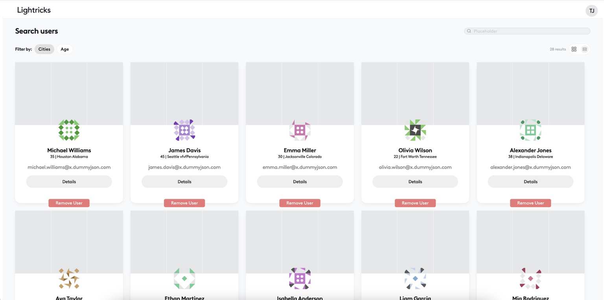
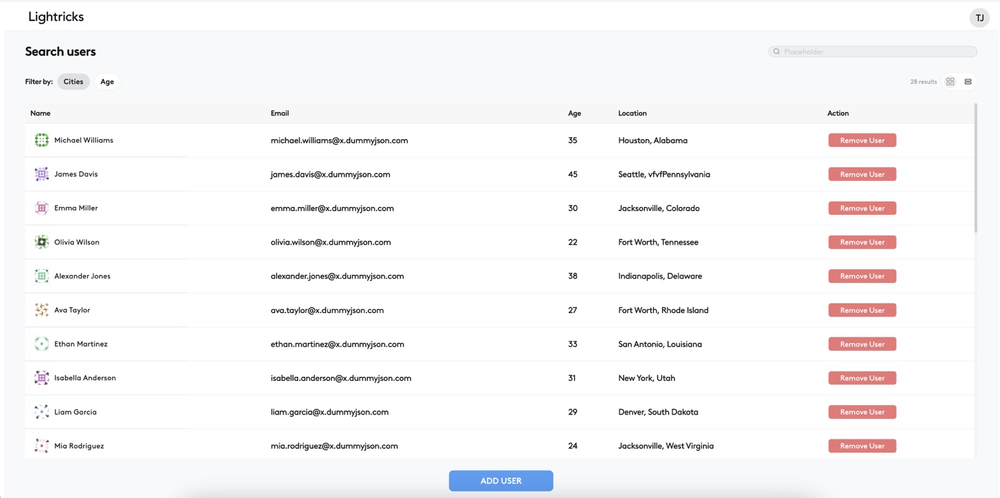
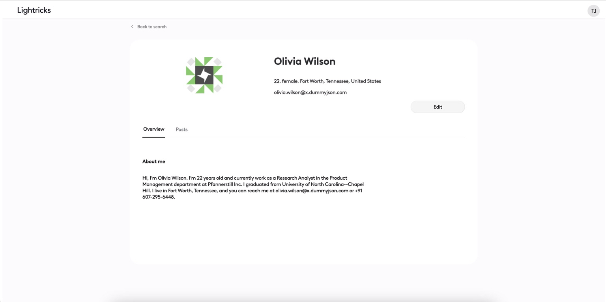
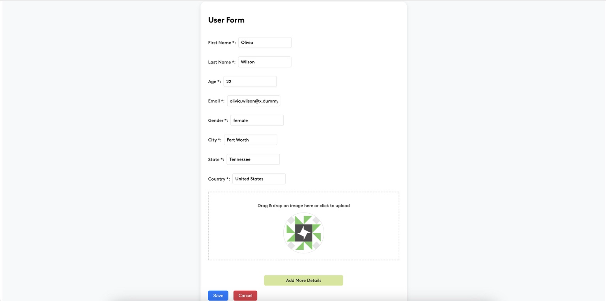

# **LTX Onboarding - React & TypeScript Exercise**

LTX Onboarding is a web-based application built using **React**, **TypeScript**, and **Zustand** for state management. This project serves as an onboarding exercise, showcasing essential web development concepts, including data fetching from APIs, state management, routing, and user profile management.

## **Table of Contents**

- [Features](#features)
- [Installation](#installation)
- [Usage](#usage)
- [Screenshots](#screenshots)
- [API Reference](#api-reference)
- [Technologies](#technologies)

---

## **Features**

- 🗂 **Fetch and Display User Data:** Users are fetched from a local JSON server.
- 👤 **User Profile Management:** View, edit, and delete user details.
- 🚀 **React Router for Navigation:** Navigate between users list and individual profile pages.
- 🗄 **Zustand for State Management:** Efficient and minimalistic state management.
- 💻 **Responsive UI:** Built with SCSS for a clean and responsive design.
- 🌐 **API Integration:** Simulated backend using `json-server`.

---

## **Installation**

Follow these steps to get the project up and running on your local machine:

### **1. Clone the repository:**

```bash
git clone git@github.com:shirrashko/LTX-onboarding.git
cd react-exercise
```

### **2. Install dependencies:**

Make sure you have Node.js installed. Then, run the following command:

```bash
npm install
```

### **3. Run the JSON server:**

Start the json-server to simulate the backend server to fetch users:

```bash
json-server --watch db.json --port 4000
```

### **4. Start the development server:**

Launch the React application:

```bash
npm run dev
```

### **5. Visit the app:**

Open your browser and navigate to:

```bash
http://localhost:3000
```

---

## **Usage**

Here’s how you can interact with the application:

1. **Home Page:**

   - Displays a list of users fetched from the JSON server.

2. **User Profiles:**

   - Navigate to a user’s profile by clicking on their name in the table / card grid.

3. **Edit User Profile:**

   - From the profile page, edit user details, which are instantly reflected in the application state.

4. **Add / Delete Users:**

   - Use the buttons to add new users or delete existing ones.

---

## **Screenshots**

<table>
  <tr>
    <td>
      
      <p align="center"><b>Grid Mode</b></p>
    </td>
    <td>
      
      <p align="center"><b>Table Mode</b></p>
    </td>
  </tr>
  <tr>
    <td>
      
      <p align="center"><b>User Profile</b></p>
    </td>
    <td>
      
      <p align="center"><b>User Form</b></p>
    </td>
  </tr>
</table>

---

## **API Reference**

The app uses a json-server to simulate backend services. The available API endpoints are:

- `GET /users`: Fetch all users.
- `GET /users/:id`: Fetch a specific user by ID.
- `POST /users`: Add a new user.
- `PUT /users/:id`: Update an existing user.
- `DELETE /users/:id`: Delete a user.

---

## **Technologies**

This project was built using the following technologies:

- **React**: A library for building user interfaces.
- **TypeScript**: A superset of JavaScript that adds static typing.
- **Zustand**: A small but efficient state management library for React.
- **React Router**: Enables routing and navigation between different pages.
- **SCSS**: CSS preprocessor for modular and maintainable styles.
- **json-server**: A fake REST API for simulating backend operations.
